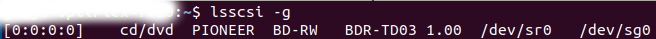
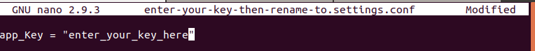
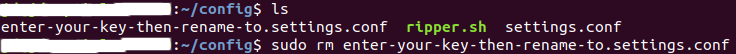

# docker-ripper

[](https://github.com/users/rix1337/sponsorship)

This container will detect optical disks by their type and rip them automatically.

# Output
Disc Type | Output | Tools used
---|---|---
CD | MP3 and FLAC | Ripit (lame/faac and flac)
Data-Disk | Uncompressed .ISO | ddrescue
DVD | MKV | MakeMKV
BluRay | MKV | MakeMKV

### Prerequistites
#### (1) Create the required directories, for example, in /home/yourusername. Do _not_ use sudo mkdir to achieve this. 

```
mkdir config rips
```
#### (2) Find out the name(s) of the optical drive
```
lsscsi -g
```
In this example, /dev/sr0 and /dev/sg0 are the two files that refer to a single optical drive. These names will be needed for the docker run command.  


## Docker run
In the command below, the paths refer to the output from your lsscsi-g command, along with your config and rips directories. If you created /home/yourusername/config and /home/yourusername/rips then those are your paths.  
```
docker run -d \
  --name="Ripper" \
  -v /path/to/config/:/config:rw \
  -v /path/to/rips/:/out:rw \
  --device=/dev/sr0:/dev/sr0 \
  --device=/dev/sg0:/dev/sg0 \
  rix1337/docker-ripper
  ```
Screenshot of Docker run command with the example provided  
  
  
  **To properly detect optical disk types in a docker environment this script relies on makemkvcon output.**

MakeMKV is free while in Beta, but requires a valid license key. Ripper tries to fetch the latest free beta key on launch. Without a purchased license key Ripper may stop running at any time.

#### If you have purchased a license key to MakeMKV/Ripper:  
1) after starting the container, go into the config directory you created, edit the file called `enter-your-key-then-rename-to.settings.conf`, and add your key between the quotes `app_Key = "`**[ENTER KEY HERE]**`"` then save and rename the file to settings.conf  

  

2) Remove the remaining file `enter-your-key-then-rename-to.settings.conf`
  

3) At this point your config directory should look like this:  


# Docker compose

Check your device mount point before you run the container!

`docker-compose up -d`

# FAQ

### How do I set ripper to do something else?

_Ripper will place a bash-file ([ripper.sh](https://github.com/rix1337/docker-ripper/blob/master/root/ripper/ripper.sh)) automatically at /config that is responsible for detecting and ripping disks. You are completely free to modify it on your local docker host. No modifications to this main image are required for minor edits to that file._

_Additionally, you have the option of creating medium-specific override scripts in that same directory location:_

Medium | Script Name | Purpose
--- | --- | ---
BluRay | `BLURAYrip.sh` | Overrides BluRay ripping commands in `ripper.sh` with script operation
DVD | `DVDrip.sh` | Overrides DVD ripping commands in `ripper.sh` with script operation
Audio CD | `CDrip.sh` | Overrides audio CD ripping commands in `ripper.sh` with script operation
Data-Disk | `DATArip.sh` | Overrides data disk ripping commands in `ripper.sh` with script operation

_Note that these optional scripts must be of the specified name, have executable permissions set, and be in the same directory as `ripper.sh` to be executed._

### How do I output AAC audio for CDs rather than FLAC and MP3?

In the ripper.sh file, search for the line that calls `ripit`. Replace `-c 0,2` with:
```
-c 7 --ffmpegsuffix m4a --ffmpegopt "-c:a libfdk_aac -b:a 256k"
```

### I want another output format that requires another piece of software!

_You need to fork this image and build it yourself on docker hub. A good starting point is the [Dockerfile](https://github.com/rix1337/docker-ripper/blob/master/Dockerfile#L30) that includes setup instructions for the used ripping software.
If your solution works better than the current one, I will happily review your pull request._

### MakeMKV needs an update!

_Make sure you have pulled the latest image. The image should be updated automatically as soon as MakeMKV is updated. This has not worked reliably in the past. Just [open a new issue](https://github.com/rix1337/docker-ripper/issues/new) and I will trigger the build._

### Am I allowed to use this in a commercial setting?

_Yes, see [LICENSE.md](https://github.com/rix1337/docker-ripper/blob/master/LICENSE.md)._
**If this project is helpful to your organization please sponsor me on [Github Sponsors](https://github.com/sponsors/rix1337)!**

### Do you offer support?

_If plausible [open a new issue](https://github.com/rix1337/docker-ripper/issues/new). I am not responsible if anything breaks. For more information see [LICENSE.md](https://github.com/rix1337/docker-ripper/blob/master/LICENSE.md)_

# Credits
- [Idea based on Discbox by kingeek](http://kinggeek.co.uk/projects/item/61-discbox-linux-bash-script-to-automatically-rip-cds-dvds-and-blue-ray-with-multiple-optical-drives-and-no-user-intervention)

  Kingeek uses proper tools (like udev) to detect disk types. This is impossible in docker right now. Hence, most of the work is done by MakeMKV (see above).

- [MakeMKV Setup by tobbenb](https://github.com/tobbenb/docker-containers)

- [MakeMKV key/version fetcher by metalight](http://blog.metalight.dk/2016/03/makemkv-wrapper-with-auto-updater.html)
